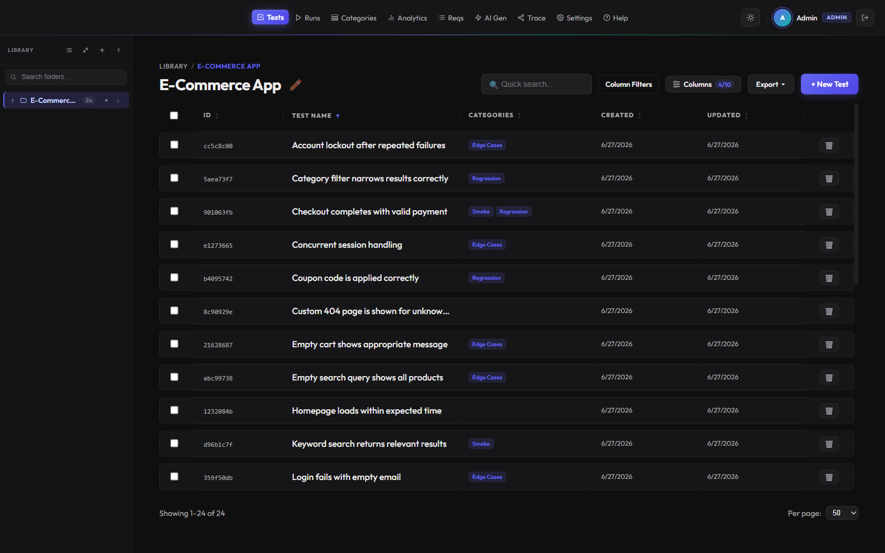
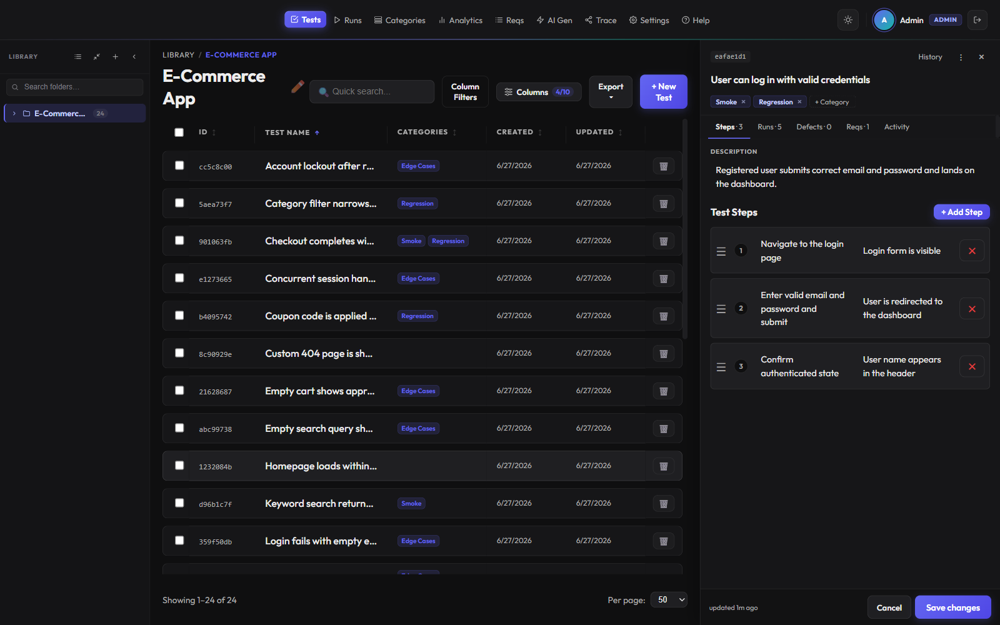
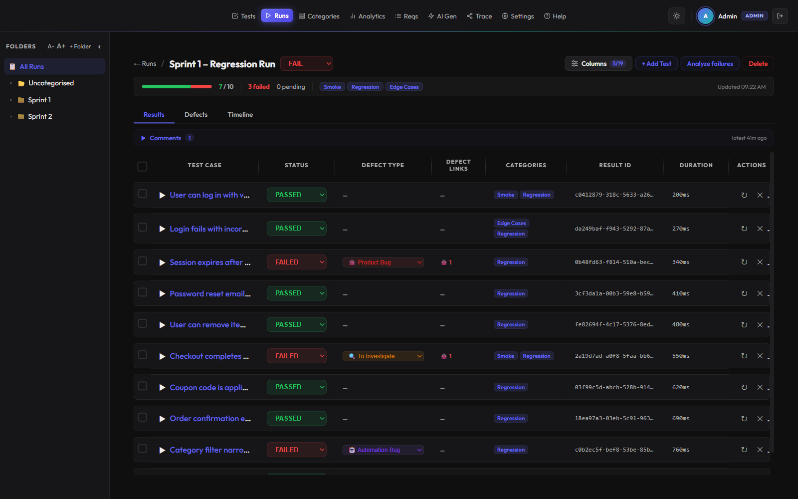
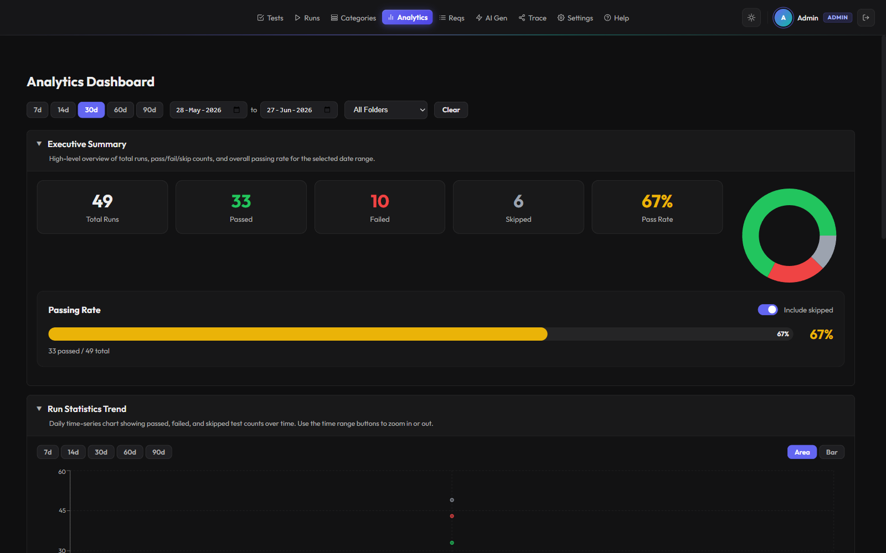
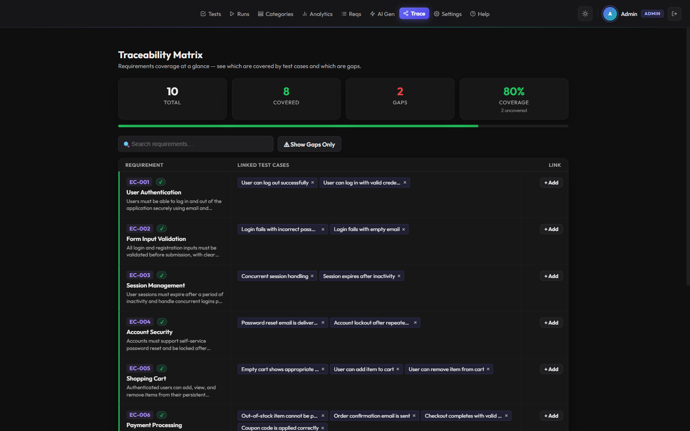
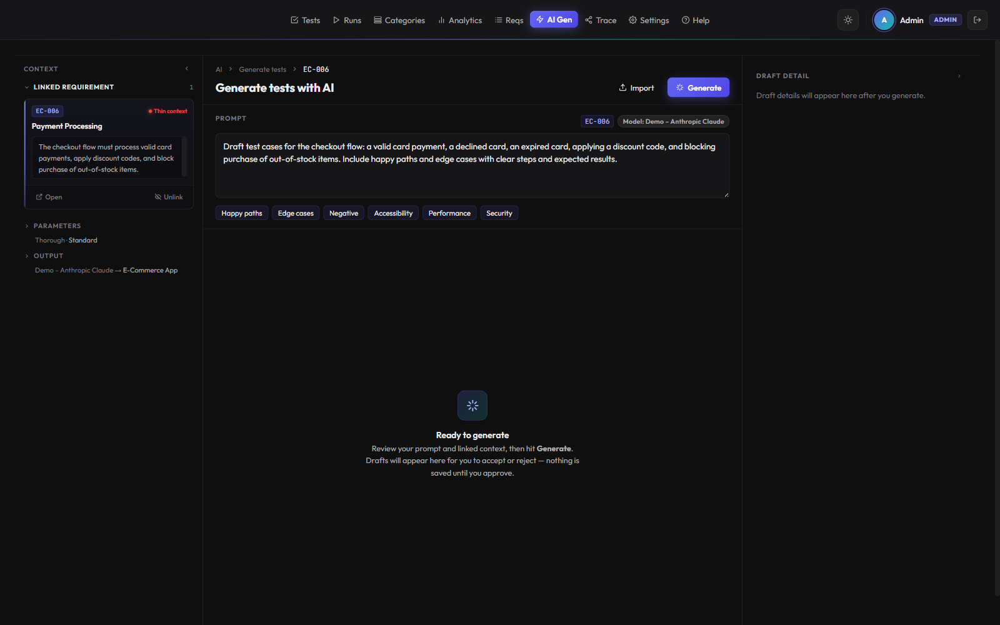

<div align="center">

# 🧪 TTGO

**Self-hosted, source-available test management — own your data, automate everything.**

[](LICENSE)
[](#tech-stack)
[](#tech-stack)
[](#deployment-docker)
[](#)



<sub><i>The test library — hierarchical folders, a filterable test grid, categories and bulk actions.</i></sub>

</div>

---

> [!NOTE]
> **This README has two parts.** Part 1 is the quick tour — what TTGO does, screenshots, and how it compares to other test management tools. [Part 2](#technical-documentation) is the technical reference — stack, local setup, configuration, deployment and API. If you just want to run it, [skip to the setup](#technical-documentation).

# Part 1 · Overview

## Why TTGO?

Test management usually forces a trade-off: a polished commercial SaaS (TestRail, Xray, qTest) that bills per seat and keeps your data on someone else's servers — or a free, self-hosted tool that feels a decade old.

**TTGO is both.** It's a modern, self-hosted, source-available platform with the features QA teams actually expect — rich test cases with version history, run execution with defect tracking, analytics with flaky-test detection, requirements traceability, AI test generation, a first-class CLI, and real-time collaboration — all running as a single Go binary against one SQLite file. Your infrastructure, your data, no per-seat pricing.

## Highlights

- 🏠 **Self-hosted — own your data.** Runs entirely on your own infrastructure as a single Go binary and one SQLite file. Source-available under PolyForm Shield — no per-seat SaaS bills, nothing leaving your network.
- 🤖 **AI test generation.** Draft test cases from requirements using your own LLM provider (bring your own key). A review-and-approve flow means nothing is saved until you accept it.
- ⌨️ **CLI & Claude Code automation.** A first-class `ttgo` CLI drives tests, runs, analytics and more from the terminal or CI — and a bundled Claude Code skill lets you operate TTGO in plain English.
- ⚡ **Real-time collaboration.** WebSocket-powered live sync keeps every open tab and teammate up to date as runs are executed and test cases change.

…plus rich-text editing with full version history, scheduled SQLite backups, API tokens & webhooks, and native Jira / Confluence integrations. See the [full feature list](#features) below.

## Feature tour

|  |  |
|:--|:--|
| <br>**Rich test cases** — TipTap rich-text descriptions, ordered steps with expected results, full version history, and tabs for runs, defects and linked requirements. | <br>**Run execution** — snapshot-based runs with per-result pass/fail, defect classification (product / automation / system), defect links, durations and comments. |
| <br>**Analytics** — pass-rate trends, flaky-test detection, slowest tests, component health and side-by-side run comparison across any date range. | <br>**Requirements & traceability** — a coverage-at-a-glance matrix linking requirements to test cases and surfacing the gaps. |

<div align="center">



<sub><i>AI test generation — pick a requirement for context, describe what you want, and let your configured model draft test cases for review.</i></sub>

</div>

## How TTGO compares

How TTGO stacks up against popular commercial and self-hosted test management tools:

| Capability | **TTGO** | TestRail | Xray | qTest | Kiwi TCMS | Qase |
|---|:---:|:---:|:---:|:---:|:---:|:---:|
| Self-hosted / on-prem | ✅ | ⚠️ <sup>1</sup> | ⚠️ <sup>2</sup> | ✅ | ✅ | ⚠️ <sup>4</sup> |
| Source-available / open source | ✅ | ❌ | ❌ | ❌ | ✅ | ❌ |
| Free to self-host (no per-seat license) | ✅ | ❌ | ❌ | ❌ | ✅ | ❌ <sup>5</sup> |
| Built-in AI test generation | ✅ | ✅ | ✅ | ✅ | ❌ | ✅ |
| First-class CLI | ✅ | ✅ | ❌ | ❌ | ⚠️ | ✅ |
| REST API | ✅ | ✅ | ✅ | ✅ | ⚠️ <sup>3</sup> | ✅ |
| Webhooks / push notifications | ✅ | ✅ | ⚠️ <sup>6</sup> | ✅ | ⚠️ | ⚠️ <sup>6</sup> |
| Requirements & traceability matrix | ✅ | ✅ | ✅ | ✅ | ⚠️ | ✅ |
| Native Jira integration | ✅ | ✅ | ✅ | ✅ | ✅ | ✅ |

<sub>✅ yes · ⚠️ partial, paid-tier-only, or caveated · ❌ no</sub>

<sub>
<b>1.</b> TestRail self-hosting is the customer-managed <i>Server</i> edition (seat minimum + annual contract); the default product is Cloud SaaS.&nbsp;
<b>2.</b> Xray runs as an app inside Jira, so on-prem requires Jira Data Center; Xray Cloud is SaaS.&nbsp;
<b>3.</b> Kiwi TCMS exposes a JSON-RPC / XML-RPC API rather than a conventional REST API.&nbsp;
<b>4.</b> Qase self-hosting is an Enterprise-tier dedicated-installation add-on; the standard product is SaaS.&nbsp;
<b>5.</b> Qase offers a free <i>cloud</i> plan (not self-hosted).&nbsp;
<b>6.</b> Webhooks vary by plan/host — e.g. Qase webhooks require a paid tier, and Xray typically relies on Jira's automation engine.
</sub>

> Competitor capabilities and pricing are summarized from public documentation as of mid-2026 and change frequently — verify the current details with each vendor. Spotted something out of date? [Open a PR](https://github.com/kirylRunets/ttgo/pulls).

---

<a id="technical-documentation"></a>

# Part 2 · Technical documentation

A self-hosted test case management tool built with Go and React.

## Features

- **Test Suite & Folder Management** — hierarchical organization with drag-and-drop reordering
- **Test Cases** — rich text descriptions and steps, full version history with diff view
- **Test Runs** — snapshot-based execution, per-step pass/fail, screenshots, comments, defect linking
- **Real-time Updates** — WebSocket-powered live sync across open browser tabs
- **Analytics** — pass rate trends, flaky test detection, duration tracking, run comparisons
- **Requirements & Traceability** — link test cases to requirements, traceability matrix view
- **Jira Integration** — create and link Jira defects directly from test runs
- **Confluence Import** — import requirements from Confluence pages
- **AI Test Generation** — generate test cases from requirements using LLM providers
- **Database Backups** — manual and scheduled SQLite backups with restore support
- **API Tokens & Webhooks** — automate runs and receive push notifications
- **CLI** — `ttgo` command-line tool for managing tests, runs, analytics, and more from the terminal
- **Swagger Docs** — full API documentation at `/swagger/`
- **User Auth** — session-based auth with admin and regular user roles
- **Demo Data** — one-click seed for exploring the UI

## Tech Stack

| Layer | Technology |
|---|---|
| Backend | Go 1.25, GORM, SQLite (`mattn/go-sqlite3`) |
| CLI | Cobra, tabwriter, JSON/table/plain output |
| API | `net/http` + `routegroup`, Gorilla WebSocket |
| Frontend | React 19.2, Vite, React Router |
| UI | TipTap (rich text), Recharts (analytics), @dnd-kit (drag & drop) |
| Deployment | Docker, Docker Compose, Nginx |

## Quick Start (local)

**Backend**

```bash
cd backend
cp .env.example .env   # set ADMIN_EMAIL and ADMIN_PASSWORD
go run ./cmd/server/
```

Runs on `http://localhost:8080`. API docs at `http://localhost:8080/swagger/`.

**Frontend**

```bash
cd frontend
npm install
npm run dev
```

Runs on `http://localhost:5173`.

**CLI**

```bash
cd backend
go build -o ttgo ./cmd/ttgo/
ttgo config set-server http://localhost:8080
ttgo config set-token <your-api-token>
ttgo tests list
```

Run `ttgo --help` for all available commands (tests, runs, folders, analytics, requirements, AI, backups, and more).

**Claude Code Integration**

The project includes a Claude Code skill (`.claude/skills/ttgo.md`) that lets you operate TTGO through natural language. With [Claude Code](https://claude.com/claude-code) installed, just describe what you need:

```
> "Run the smoke tests and report the results"
> "Find all flaky tests and show their recent executions"
> "Import REQ-42 from Jira and generate test cases for it"
```

Claude Code will translate your request into the appropriate `ttgo` CLI commands, parse the output, and chain multi-step workflows automatically. The skill is loaded automatically when working in this repo.

**E2E result reporting (dogfooding)**

The Playwright e2e suite can push its own results into a running TTGO instance as
a test run. It is opt-in: set `TTGO_REPORT_TOKEN` (a **write**-scoped API token from
**Settings → API Tokens**) and the reporter auto-provisions a `Playwright E2E` folder,
category, and one test case per Playwright test, then records each run with per-test
pass/fail, duration, and failure details. With the token unset, the suite behaves exactly
as before.

```bash
cd frontend
TTGO_REPORT_TOKEN=<write-token> npx playwright test
```

| Variable | Default | Description |
|---|---|---|
| `TTGO_REPORT_TOKEN` | — | Write-scoped API token. **Unset = reporter disabled.** |
| `TTGO_REPORT_URL` | `http://localhost:8080` | TTGO API base URL to push results to |
| `TTGO_REPORT_FOLDER` | `Playwright E2E` | Folder that holds the auto-provisioned test cases |
| `TTGO_REPORT_CATEGORY` | `Playwright E2E` | Category attached to each run |
| `TTGO_REPORT_RUN_NAME` | `Playwright E2E` | Run-name prefix (a timestamp is appended) |
| `TTGO_REPORT_ENV` | `e2e` | `environment` label stored on each result |

Reporting failures are logged and never fail the test run.

## Configuration

The backend is configured via environment variables (or a `.env` file in the `backend/` directory):

| Variable | Default | Description |
|---|---|---|
| `DB_PATH` | `tracker.db` | Path to the SQLite database file |
| `ADMIN_EMAIL` | — | Email for the auto-created admin account |
| `ADMIN_PASSWORD` | — | Password for the auto-created admin account |
| `CORS_ORIGIN` | `http://localhost:5173` | Allowed CORS origin |
| `LISTEN_ADDR` | `:8080` | Address the server listens on |

<a id="deployment-docker"></a>

## Deployment (Docker)

Copy the example env file and fill in your values:

```bash
cp .env.example .env
```

Build and start:

```bash
docker compose up -d --build
```

The app will be available on port `80`. The backend API is proxied under `/api/` and WebSocket under `/ws`.

**Redeploy after updates:**

```bash
git pull
docker compose up -d --build
```

## API

Full REST API documentation is available at `/swagger/` when the server is running.

Quick example — trigger a test run from CI:

```bash
# Create a run
curl -X POST http://localhost:8080/api/runs \
  -H "Authorization: Bearer <token>" \
  -H "Content-Type: application/json" \
  -d '{"suite_id": "YOUR_SUITE_ID", "name": "CI Run #42"}'

# Update a result
curl -X PUT http://localhost:8080/api/runs/{run_id}/results/{test_id} \
  -H "Authorization: Bearer <token>" \
  -H "Content-Type: application/json" \
  -d '{"status": "passed"}'
```

## License & Usage

This project is licensed under the [**PolyForm Shield License 1.0.0**](https://polyformproject.org/licenses/shield/1.0.0) — see [LICENSE](LICENSE).

PolyForm Shield is a standard source-available license. In plain terms:

✅ **Free to use for:**
- Internal tools
- Personal projects
- Embedding into your own (non-competing) product

❌ **Not allowed without a commercial license:**
- Offering a product that competes with TTGO (including as a SaaS)
- Reselling TTGO as a standalone product
- Building a competing QA / test case management system

### Commercial Use

If you want to use this project in a way the license doesn't permit (SaaS, white-label, competing product, etc.), you need a commercial license.

### Why this license?

We want this project to be:
- Open enough for developers to use and build with
- Protected from being resold or turned into a competing service

The full legal terms are in [LICENSE](LICENSE); the bullets above are a summary for convenience only.
