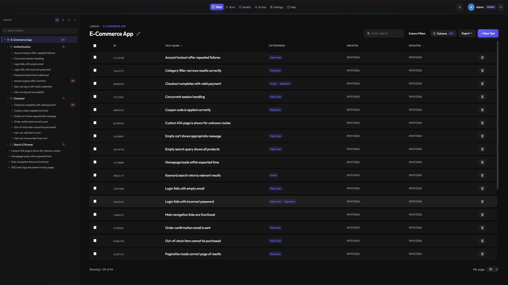
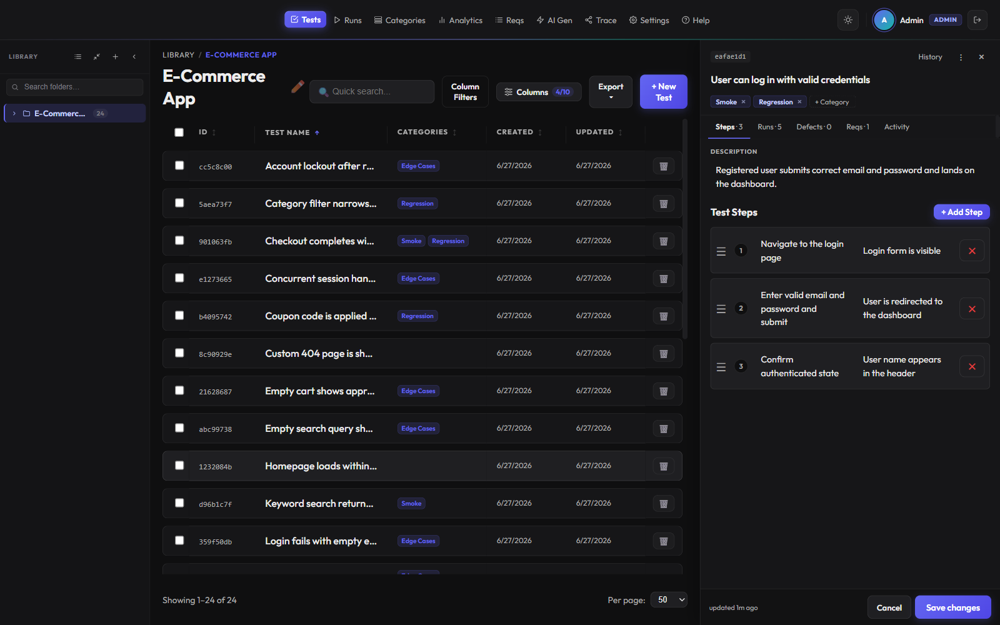
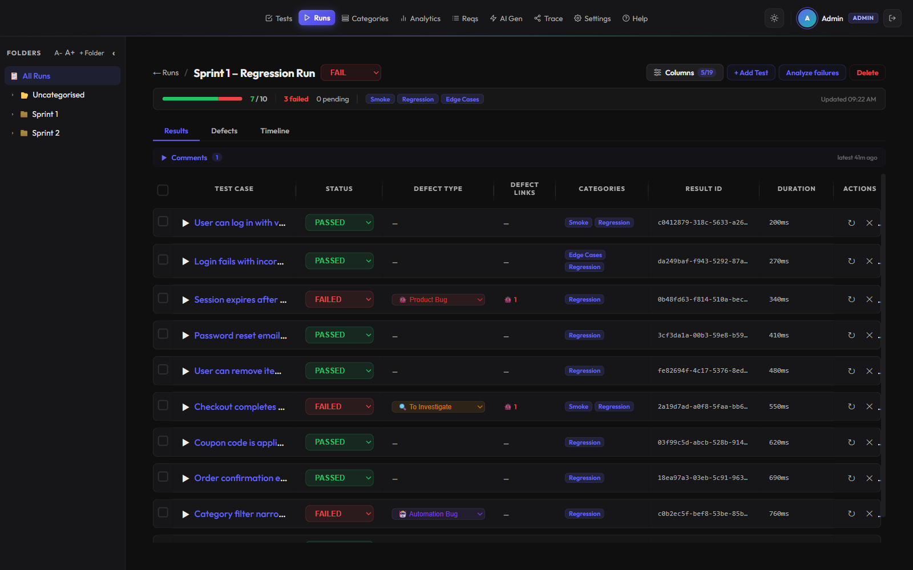
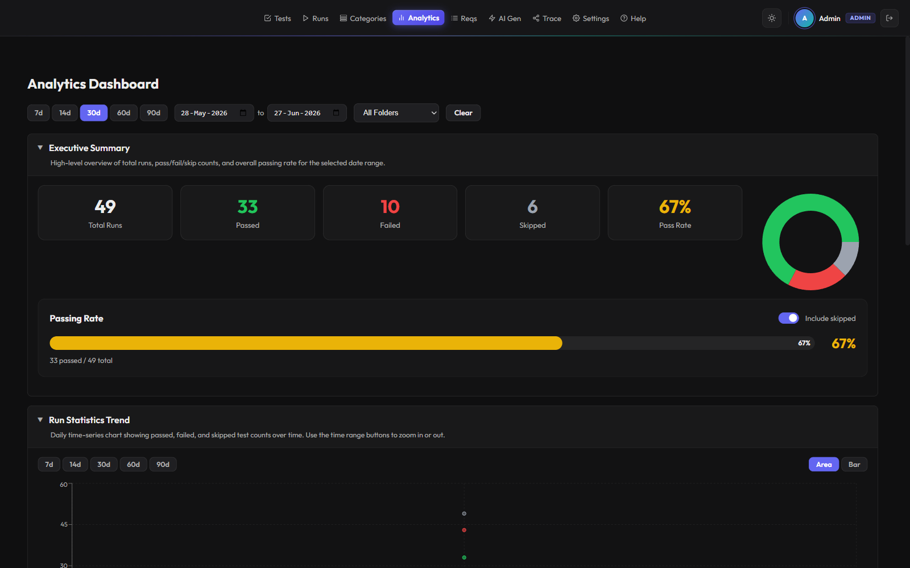
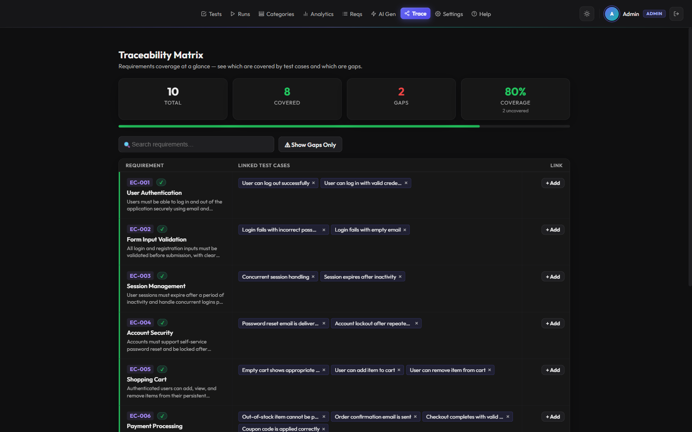
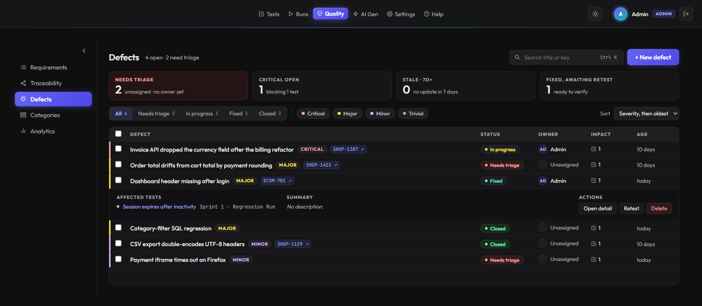
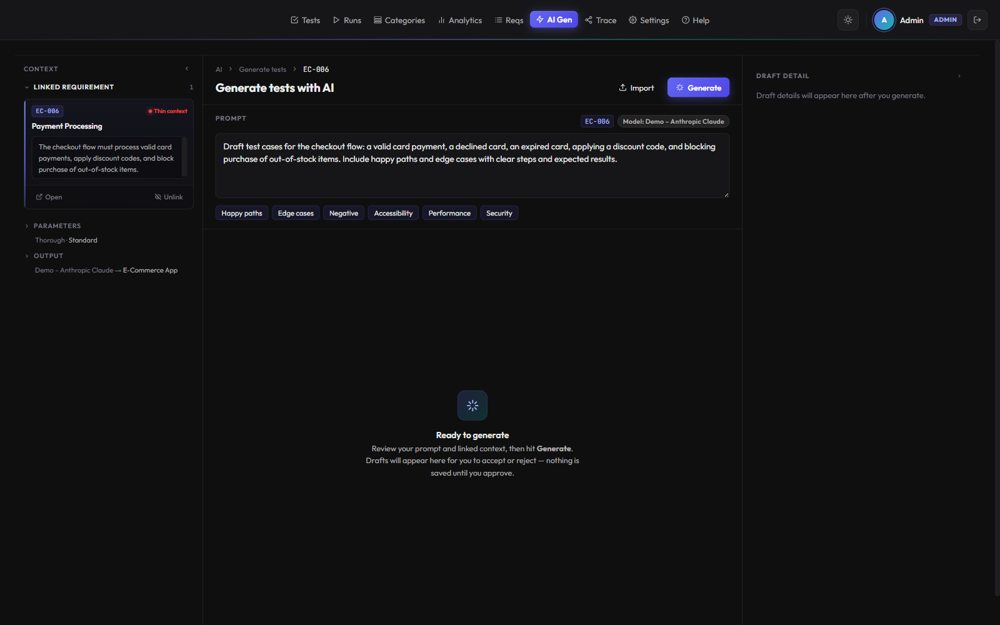

<div align="center">

# 🧪 TTGO

**Self-hosted, source-available test management — own your data, automate everything.**

[](LICENSE)
[](#tech-stack)
[](#tech-stack)
[](#deployment-docker)
[](#)



<sub><i>The test library — hierarchical folders, a filterable test grid, categories and bulk actions.</i></sub>

</div>

---

> [!NOTE]
> **This README has two parts.** Part 1 is the quick tour — what TTGO does, screenshots, and how it compares to other test management tools. [Part 2](#technical-documentation) is the technical reference — stack, local setup, configuration, deployment and API. If you just want to run it, [skip to the setup](#technical-documentation).

# Part 1 · Overview

## Why TTGO?

Test management usually forces a trade-off: a polished commercial SaaS (TestRail, Xray, qTest) that bills per seat and keeps your data on someone else's servers — or a free, self-hosted tool that feels a decade old.

**TTGO is both.** It's a modern, self-hosted, source-available platform with the features QA teams actually expect — rich test cases with version history, run execution with defect tracking, analytics with flaky-test detection, requirements traceability, AI test generation, a first-class CLI, and real-time collaboration — all running as a single Go binary against one SQLite file. Your infrastructure, your data, no per-seat pricing.

## Highlights

- 🏠 **Self-hosted — own your data.** Runs entirely on your own infrastructure as a single Go binary and one SQLite file. Source-available under PolyForm Shield — no per-seat SaaS bills, nothing leaving your network.
- 🤖 **AI test generation.** Draft test cases from a requirement — or from a free-text prompt alone — using your own LLM provider (bring your own key). A review-and-approve flow with editing, regeneration and coverage analysis means nothing is saved until you accept it.
- 🔍 **AI failure triage — and it grades itself.** When tests fail, TTGO classifies each failure with your own LLM — product bug, flaky test, environment, test data or infrastructure — grounded in that test's own recent history and how your team triaged it before. It offers the verdict as a *suggested* defect type you accept with one click, never writing the decision for you, then reports how often its suggestions actually matched your calls, split by confidence, so you can see whether it's worth trusting.
- ⌨️ **CLI & agent automation.** A first-class `ttgo` CLI drives tests, runs, analytics and more from the terminal or CI. The bundled Claude Code skill lets an agent operate TTGO in plain English — even read your app's code to draft test cases — and slot it into your automation loop. And since the skill is just Markdown in your repo, you can have your agent extend it for your own workflows.
- ⚡ **Real-time collaboration.** WebSocket-powered live sync keeps every open tab and teammate up to date as runs are executed and test cases change.

…plus built-in defect tracking, rich-text editing with full version history, scheduled SQLite backups, API tokens & webhooks, and Jira / Confluence integrations. See the [full feature list](#features) below.

## Feature tour

|  |  |
|:--|:--|
| <br>**Rich test cases** — TipTap rich-text descriptions, ordered steps with expected results, full version history, and tabs for runs, defects and linked requirements. | <br>**Run execution** — snapshot-based runs with per-result pass/fail, defect classification (product / automation / system) with AI-suggested triage you accept or override, defect links, durations and comments. |
| <br>**Analytics** — pass-rate trends, flaky-test detection, slowest tests, component health and side-by-side run comparison across any date range. | <br>**Requirements & traceability** — a coverage-at-a-glance matrix linking requirements to test cases and surfacing the gaps. |
| <br>**Native defect tracking** — lightweight bugs with severity and status, linked to failing results and managed on a dedicated Defects page in the Quality workspace; optionally reference an external Jira issue. | <br>**AI test generation** — pick a requirement for context (or skip it and just describe what to test), and let your configured model draft test cases for review. |

## How TTGO compares

How TTGO stacks up against popular commercial and self-hosted test management tools:

| Capability | **TTGO** | TestRail | Xray | qTest | Kiwi TCMS | Qase |
|---|:---:|:---:|:---:|:---:|:---:|:---:|
| Self-hosted / on-prem | ✅ | ⚠️ <sup>1</sup> | ⚠️ <sup>2</sup> | ✅ | ✅ | ⚠️ <sup>4</sup> |
| Source-available / open source | ✅ | ❌ | ❌ | ❌ | ✅ | ❌ |
| Free to self-host (no per-seat license) | ✅ | ❌ | ❌ | ❌ | ✅ | ❌ <sup>5</sup> |
| Built-in AI test generation | ✅ | ✅ | ✅ | ✅ | ❌ | ✅ |
| First-class CLI | ✅ | ✅ | ❌ | ❌ | ⚠️ | ✅ |
| REST API | ✅ | ✅ | ✅ | ✅ | ⚠️ <sup>3</sup> | ✅ |
| Webhooks / push notifications | ✅ | ✅ | ⚠️ <sup>6</sup> | ✅ | ⚠️ | ⚠️ <sup>6</sup> |
| Requirements & traceability matrix | ✅ | ✅ | ✅ | ✅ | ⚠️ | ✅ |
| Native Jira integration | ✅ | ✅ | ✅ | ✅ | ✅ | ✅ |

<sub>✅ yes · ⚠️ partial, paid-tier-only, or caveated · ❌ no</sub>

<sub>
<b>1.</b> TestRail self-hosting is the customer-managed <i>Server</i> edition (seat minimum + annual contract); the default product is Cloud SaaS.&nbsp;
<b>2.</b> Xray runs as an app inside Jira, so on-prem requires Jira Data Center; Xray Cloud is SaaS.&nbsp;
<b>3.</b> Kiwi TCMS exposes a JSON-RPC / XML-RPC API rather than a conventional REST API.&nbsp;
<b>4.</b> Qase self-hosting is an Enterprise-tier dedicated-installation add-on; the standard product is SaaS.&nbsp;
<b>5.</b> Qase offers a free <i>cloud</i> plan (not self-hosted).&nbsp;
<b>6.</b> Webhooks vary by plan/host — e.g. Qase webhooks require a paid tier, and Xray typically relies on Jira's automation engine.
</sub>

> Competitor capabilities and pricing are summarized from public documentation as of mid-2026 and change frequently — verify the current details with each vendor. Spotted something out of date? [Open a PR](https://github.com/runetsk/ttgo/pulls).

---

<a id="technical-documentation"></a>

# Part 2 · Technical documentation

A self-hosted test case management tool built with Go and React.

## Features

- **Test Suite & Folder Management** — hierarchical organization with drag-and-drop reordering
- **Test Cases** — rich text descriptions and steps, full version history with diff view
- **Test Runs** — snapshot-based execution, per-step pass/fail, screenshots, comments, native defect linking
- **Defect Tracking** — native, lightweight defects (title, description, severity, status) linked to test results and managed on a dedicated Defects page; optionally reference an external issue (e.g. Jira)
- **Real-time Updates** — WebSocket-powered live sync across open browser tabs
- **Analytics** — pass rate trends, flaky test detection, duration tracking, run comparisons
- **Requirements & Traceability** — link test cases to requirements, traceability matrix view
- **Jira Integration** — import requirements from Jira and post generated test cases back to the ticket
- **Confluence Import** — import requirements from Confluence pages
- **AI Test Generation** — generate test cases from a requirement or from a free-text prompt alone, using your own LLM provider; review, edit, regenerate, and accept drafts (nothing is saved until you approve), with coverage analysis and an optional critic pass
- **AI Failure Analysis** — classify failing results (product bug / flaky test / environment / test data / infrastructure) using your own LLM provider, grounded in the test's own recent failures, its linked defects and requirements, and how your team triaged it before. Verdicts are surfaced as a *suggested* defect type with one-click accept — never written automatically — and TTGO tracks how often its suggestions matched your actual decisions, broken down by verdict and confidence. Secrets are redacted before anything is sent, and automatic analysis is opt-in per provider
- **Database Backups** — manual and scheduled SQLite backups with restore support
- **API Tokens & Webhooks** — automate runs and receive push notifications
- **CLI** — `ttgo` command-line tool for managing tests, runs, analytics, and more from the terminal
- **Swagger Docs** — full API documentation at `/swagger/`
- **User Auth** — session-based auth with admin and regular user roles
- **Demo Data** — one-click seed for exploring the UI

## Tech Stack

| Layer | Technology |
|---|---|
| Backend | Go 1.25, GORM, SQLite (`mattn/go-sqlite3`) |
| CLI | Cobra, tabwriter, JSON/table/plain output |
| API | `net/http` + `routegroup`, Gorilla WebSocket |
| Frontend | React 19.2, Vite, React Router |
| UI | TipTap (rich text), Recharts (analytics), @dnd-kit (drag & drop) |
| Deployment | Docker, Docker Compose, Nginx |

## Quick Start (local)

**System requirements**

TTGO is deliberately light — a single Go binary and one SQLite file. Measured
footprint (see [Performance](#performance)): ~30 MB RAM idle, under 200 MB even
at maximum load with 1,000 live WebSocket clients; the database grows roughly
2 GB per million stored results.

| | Minimum (evaluation / small team) | Recommended (busy CI, large history) |
|---|---|---|
| CPU | 1 core | 2+ cores (the ~500 results/s ingest ceiling was measured on 10) |
| RAM | 512 MB | 1 GB (covers Docker + nginx comfortably) |
| Disk | 1 GB | 10 GB+ — ~2 GB per 1M results, plus WAL headroom during sustained CI bursts |

Any small VPS or spare machine qualifies. Building from source needs the Go
toolchain (1.25+, CGO with a C compiler for SQLite FTS5) and Node 22 for the
frontend; the Docker deployment needs neither.

**Backend**

```bash
cd backend
make setup             # one-time: enables the required sqlite_fts5 build tag (needs CGO + gcc)
cp .env.example .env   # optionally set ADMIN_EMAIL/ADMIN_PASSWORD (else create the admin in-browser on first run)
go run ./cmd/server/
```

Runs on `http://localhost:8080`. API docs at `http://localhost:8080/swagger/`.

**Frontend**

```bash
cd frontend
npm install
npm run dev
```

Runs on `http://localhost:5173`.

**CLI**

```bash
cd backend
make setup                     # if not already done
go build -o ttgo ./cmd/ttgo/
ttgo config set-server http://localhost:8080
ttgo config set-token <your-api-token>
ttgo tests list
```

Run `ttgo --help` for all available commands (tests, runs, folders, analytics, requirements, AI, backups, and more).

**Claude Code & agent automation**

Any agent or script can drive TTGO — every operation is a `ttgo` command — so it drops straight into an agent's loop. To make that turnkey, the repo ships a Claude Code skill (`.claude/skills/ttgo/SKILL.md`) that teaches an agent the whole command surface. It's a deliberately lightweight alternative to an MCP server: no separate integration to build, run, or keep in sync with the API — the skill just points your agent at the CLI, so it works with any agent that can run a shell. With [Claude Code](https://claude.com/claude-code) installed (the skill loads automatically when you work in this repo), just describe what you need:

```
> "Run the smoke tests and report the results"
> "Find all flaky tests and show their recent executions"
> "Import REQ-42 from Jira and generate test cases for it"
```

The agent translates each request into `ttgo` commands, parses the output, and chains multi-step workflows on its own.

**From code to coverage.** Point the agent at your own application and let it make the analysis-to-authoring hop — read the frontend or backend, work out what needs testing, and create the cases in TTGO for you:

```
> "Analyze the checkout flow in frontend/src and write test cases for it in TTGO"
> "Review the payments handlers in backend/ and add coverage for the edge cases we're missing"
```

It reads the code, drafts the cases, and creates them through the CLI — either authoring them directly or routing through TTGO's AI generation and its review-and-approve flow so nothing lands unchecked.

**Close the loop.** Point the same setup at your CI and let the agent react after every build:

```
> "After the nightly run, open a defect for each new failure, pull the flaky-test
>  history for anything intermittent, and draft test cases for the requirements
>  that dropped below full coverage."
```

The same commands run headless in CI (e.g. `claude -p "<prompt>"`), so the loop works unattended as well as interactively.

**Make the skill yours.** The skill is plain Markdown in your repo — nothing is baked into TTGO. Ask your agent to extend it for the way your team works: add your smoke-run recipe, your defect-triage conventions, a release-readiness check, or a CI entrypoint, then commit it. As the `ttgo` CLI grows, tell your agent to refresh the skill to match.

**E2E result reporting (dogfooding)**

The Playwright e2e suite can push its own results into a running TTGO instance as
a test run. It is opt-in: set `TTGO_REPORT_TOKEN` (a **write**-scoped API token from
**Settings → API Tokens**) and the reporter auto-provisions a `Playwright E2E` folder,
category, and one test case per Playwright test, then records each run with per-test
pass/fail, duration, and failure details. With the token unset, the suite behaves exactly
as before.

```bash
cd frontend
TTGO_REPORT_TOKEN=<write-token> npx playwright test
```

| Variable | Default | Description |
|---|---|---|
| `TTGO_REPORT_TOKEN` | — | Write-scoped API token. **Unset = reporter disabled.** |
| `TTGO_REPORT_URL` | `http://localhost:8080` | TTGO API base URL to push results to |
| `TTGO_REPORT_FOLDER` | `Playwright E2E` | Folder that holds the auto-provisioned test cases |
| `TTGO_REPORT_CATEGORY` | `Playwright E2E` | Category attached to each run |
| `TTGO_REPORT_RUN_NAME` | `Playwright E2E` | Run-name prefix (a timestamp is appended) |
| `TTGO_REPORT_ENV` | `e2e` | `environment` label stored on each result |

Reporting failures are logged and never fail the test run.

## Configuration

The backend is configured via environment variables (or a `.env` file in the `backend/` directory):

| Variable | Default | Description |
|---|---|---|
| `DB_PATH` | `tracker.db` | Path to the SQLite database file |
| `ADMIN_EMAIL` | — | Optional. Email for a seeded admin account. Leave blank to create the admin in the browser on first run (the "Create admin account" screen) |
| `ADMIN_PASSWORD` | — | Optional. Password for the seeded admin account (see `ADMIN_EMAIL`) |
| `CORS_ORIGIN` | `http://localhost:5173` | Allowed CORS origin |
| `LISTEN_ADDR` | `:8080` | Address the server listens on |
| `TTGO_ENCRYPTION_KEY` | — | Optional. At-rest encryption key for stored secrets (LLM/integration API keys). Auto-generated and persisted beside the database if unset; set a 32-byte value (hex, base64, or a 32-char string) to manage it yourself |

### Password recovery

Any administrator can reset another user's password from **Settings → Users → Reset Password**, and every signed-in user can change their own in **Settings → Account**.

If nobody who could do that can sign in — typically a sole-admin instance — use the break-glass command on the server host. The server binary doubles as the recovery tool: it opens the database directly (honouring `DB_PATH` and `.env` exactly like the server), so no login is required; shell access to the host is the authorization.

```bash
# Docker
docker compose exec backend ./ttgo reset-password admin@example.com
```

```bash
# Bare metal — from the server's working directory, or with DB_PATH set
./server reset-password admin@example.com
```

It prints a generated temporary password, re-enables the account if it was deactivated, and signs out all of the account's existing sessions. The server can keep running — the new password works immediately. Sign in with it, then change it in **Settings → Account**.

<a id="deployment-docker"></a>

## Deployment (Docker)

Copy the example env file and fill in your values. The example file lives at the repo root.

```bash
cp .env.example .env
```

Build and start:

```bash
docker compose up -d --build
```

The app will be available on port `80`. The backend API is proxied under `/api/` and WebSocket under `/ws`.

**Redeploy after updates:**

```bash
git pull
docker compose up -d --build
```

## Performance

Measured with the load-test suite in [`perf/`](perf/README.md) (k6 against a single
instance — one Go binary, one SQLite file — on an M1 Pro laptop, load generator on
the same machine, so the numbers are conservative):

- **Result ingestion:** one instance sustains **~500 results/s**; up to **~55
  concurrent CI pipelines** report simultaneously before add-result p95 exceeds
  500 ms. Overload degrades gracefully — latency rises, errors stay near zero
  (first 5xx at ~135 concurrent pipelines), recovery is immediate.
- **Dashboards stay fast while CI reports:** read latencies are statistically
  unchanged under a sustained 250 results/s ingest load (SQLite WAL concurrent
  reads, verified empirically).
- **Large datasets:** full-text search and run-detail pages stay flat up to
  **1M results** (search ≤16 ms p95); the runs list serves a page in ~61 ms p95
  at that scale.
- **Live updates:** **1,000 concurrent WebSocket clients** receive result events
  with ~26 ms p95 broadcast lag.
- A regression gate (`make -C perf gate`) guards these numbers against future
  changes. Methodology, caveats, and reproduction: [`perf/README.md`](perf/README.md).

## API

Full REST API documentation is available at `/swagger/` when the server is running.

Quick example — trigger a test run from CI:

```bash
# Create a run
curl -X POST http://localhost:8080/api/runs \
  -H "Authorization: Bearer <token>" \
  -H "Content-Type: application/json" \
  -d '{"suite_id": "YOUR_SUITE_ID", "name": "CI Run #42"}'

# Update a result
curl -X PUT http://localhost:8080/api/runs/{run_id}/results/{test_id} \
  -H "Authorization: Bearer <token>" \
  -H "Content-Type: application/json" \
  -d '{"status": "passed"}'
```

## License & Usage

TTGO is source-available under the [**PolyForm Shield License 1.0.0**](https://polyformproject.org/licenses/shield/1.0.0) — see [LICENSE](LICENSE). For almost everyone, that means one thing: **it's free** — no per-seat bills, no time limits, no catch.

✅ **Free to use for:**
- Running it internally — your team, your company, your infrastructure
- Personal projects, side projects, and evaluation
- Embedding it inside your own product, as long as that product doesn't compete with TTGO

**The only catch** — the few things PolyForm Shield doesn't allow:
- Re-offering TTGO itself as a hosted service (SaaS)
- White-labeling or reselling it as a standalone product
- Using it to build a competing test-management tool

In plain terms: build on it, run it, ship your product on it — just don't repackage TTGO into a competitor. The full legal terms are in [LICENSE](LICENSE); the bullets above are a summary for convenience only.
